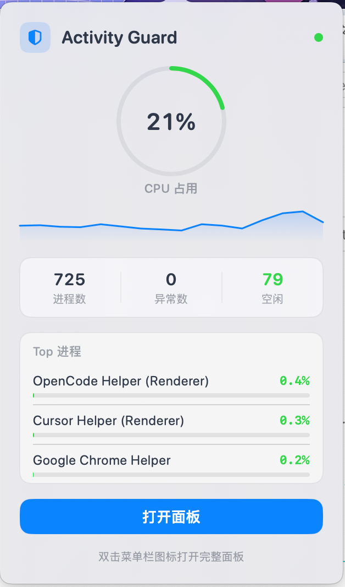
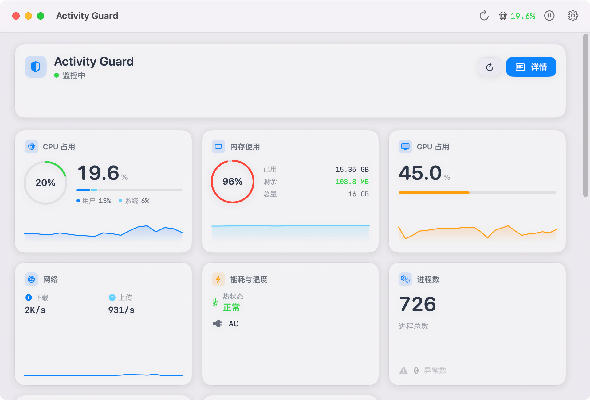
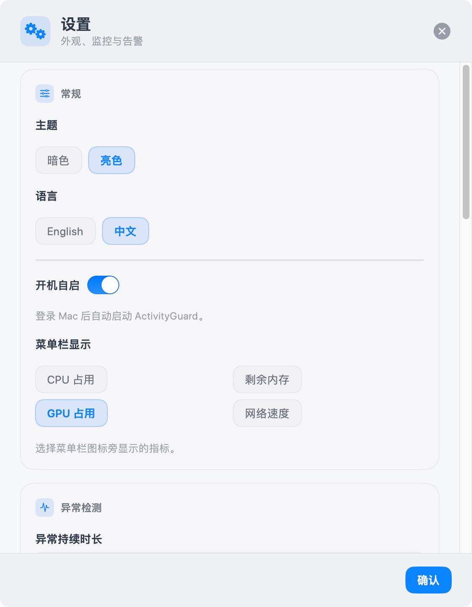

# ActivityGuard

<p align="center">
  
</p>

<p align="center">
  轻量 macOS 菜单栏系统监控工具 · 实时追踪资源占用 · 智能检测异常进程
</p>

<p align="center">
  A lightweight macOS menu bar monitor for system metrics and anomalous processes.
</p>

---

## Screenshots

### 1. 菜单栏小面板

<p align="center">
  
</p>

单击菜单栏图标弹出，查看 CPU 环形图、进程统计与 Top 进程；双击可打开完整仪表盘。

### 2. 仪表盘

<p align="center">
  
</p>

完整 Dashboard：KPI 卡片、Sparkline 趋势、进程总数与异常告警入口。

### 3. 设置

<p align="center">
  
</p>

卡片式设置面板（560×720）：主题 / 语言、异常持续时长、严重泄漏阈值、白名单、通知与温度提醒等。

---

## Features

### Menu Bar

- 菜单栏实时显示 **CPU / 可用内存 / GPU / 网络**（可在设置中切换）
- **单击**图标：弹出小面板，查看 CPU 环形图、Top 进程与异常摘要
- **双击**图标：打开完整仪表盘
- **右键**：快捷打开面板、暂停/恢复监控、退出

### Dashboard

- **CPU / 内存 / GPU / 网络 / 电源** KPI 卡片，含 Sparkline 趋势图
- 进程总数、异常告警、最高消耗进程一览
- Top 进程列表，支持跳转完整进程视图

### Process List

- 按 CPU、CPU 时间、线程、内存、PID、名称排序
- 搜索过滤 + 按异常类型筛选
- 异常进程高亮标记（High CPU / Memory Leak / Zombie / High Energy）
- 一键终止进程（PID > 100，带确认）

### Alerts & Settings

- 异常进程系统通知，可配置通知间隔
- 过热（Thermal）状态提醒
- 开机自启动
- 暗色 / 亮色主题
- 中 / 英双语界面
- 设置面板卡片式布局（560×720），分区：常规 / 异常检测 / 通知 / 温度 / 规则 / 测试

---

## 异常检测与告警

监控默认每 **10 秒**采样一次。检测到「原始异常」后，还需满足**持续时长**才会在界面与通知中展示，用于过滤短暂波动。

### 持续时长（默认 5 秒）

| 项目 | 说明 |
|------|------|
| 设置项 | **异常持续时长** |
| 默认值 | **5 秒** |
| 范围 | 0～120 秒 |
| 行为 | 异常状态连续维持达到设定秒数后才提示；消失则计时清零 |
| 设为 0 | 立即提示（不做持续过滤） |

适用于所有异常类型（高 CPU、内存泄漏、僵尸进程、高能耗等）。菜单栏、仪表盘、进程列表与系统通知均遵循同一规则。

### 异常类型与判定条件

| 类型 | 判定条件 | 界面 | 系统通知 |
|------|----------|------|----------|
| **僵尸进程** | 进程已退出但未回收 | 灰色标记 | ✅ 始终推送 |
| **CPU 过高** | 连续 2 次采样 ≥ 95% | 红色 | ❌ 仅应用内 |
| **持续高 CPU** | 约 40 秒内持续 ≥ 85% | 橙色 | ❌ 仅应用内 |
| **内存泄漏（普通）** | 见下表 | 橙色 | ❌ 仅应用内 |
| **内存泄漏（严重）** | 见下表 + 严重阈值 | 红色 | ✅ 推送 |

#### 内存泄漏基础规则

需**同时满足**（观测窗口约 40～50 秒，5 次采样）：

1. 起始 RSS ≥ **50 MB**
2. 当前 RSS ≥ 起始 × **2**（翻倍）
3. 增量 ≥ **+100 MB**

#### 内存泄漏分级

| 级别 | 条件 | 菜单栏 | 通知 |
|------|------|--------|------|
| **普通** | 满足基础规则 | 橙色数字 | 无 |
| **严重** | 增量 ≥ **严重阈值**（默认 **300 MB**），或当前 RSS ≥ **1 GB** | 红色三角 | 有（独立标题与文案） |

**严重阈值**可在设置中调节（100～2048 MB，步进 50 MB，默认 300 MB）。

#### 内存泄漏白名单

设置 → **内存泄漏白名单**，逗号分隔进程名**关键词**（子串匹配）。默认包含 Chrome、Safari、Xcode、node、java、Docker 等。匹配到的进程**不做**内存泄漏检测。

### 系统通知策略

| 事件 | 是否通知 |
|------|----------|
| 僵尸进程 | ✅ |
| 严重内存泄漏 | ✅ |
| 普通内存泄漏 / 高 CPU / 高能耗 | ❌ |
| 温度过高（Serious / Critical） | ✅（独立开关） |

通知间隔可在设置中选择（15 秒～1 小时）；同一间隔内多条异常会合并为一条通知。

### 菜单栏异常指示

| 状态 | 显示 |
|------|------|
| 无异常 | 当前所选指标（CPU / 内存 / GPU / 网络） |
| 仅有普通级异常 | 橙色数字 + 圆圈叹号 |
| 有严重泄漏 / 僵尸 / 高 CPU | 红色数字 + 三角叹号 |

---

## 设置说明

设置入口：主窗口工具栏 **⚙️**。面板宽 **560 px**，可滚动，分以下卡片：

| 分区 | 内容 |
|------|------|
| **常规** | 主题、语言、开机自启、菜单栏显示项 |
| **异常检测** | 异常持续时长、严重泄漏阈值、内存泄漏白名单 |
| **通知** | 异常通知开关、通知间隔 |
| **温度** | 温度过高提醒开关 |
| **判定规则** | 完整异常规则说明 |
| **测试通知** | 发送测试通知、查看权限状态 |

---

## Requirements

| Item | Version |
|------|---------|
| macOS | 14.0+ |
| Architecture | Apple Silicon or Intel |
| Build | Xcode Command Line Tools |

---

## Installation

从 [Releases](https://github.com/Wuboing/ActivityGuard/releases) 下载 `ActivityGuard.dmg`，拖入「应用程序」即可。

> 首次打开若被 Gatekeeper 拦截：**右键 → 打开**。

---

## Build from Source

```bash
git clone git@github.com:Wuboing/ActivityGuard.git
cd ActivityGuard
bash scripts/build-dmg.sh
```

产物路径：

```
dist/ActivityGuard.app
dist/ActivityGuard.dmg
```

> 构建脚本默认使用项目内 `.toolchain/` 下的 Swift 编译器（已在 `.gitignore` 中，需自行准备或修改 `scripts/build-dmg.sh` 中的 `TOOLCHAIN_SWIFTC` 路径）。

### Replace App Icon

将源图放到 `Resources/AppIcon.png`，然后执行：

```bash
bash scripts/generate-app-icon.sh
```

脚本会自动裁剪圆角黑边并生成 `AppIcon.icns`。

---

## Usage

| 操作 | 效果 |
|------|------|
| 单击菜单栏图标 | 打开小面板（Metrics Popover） |
| 双击菜单栏图标 | 打开完整 Dashboard |
| 工具栏 ⚙️ | 打开设置面板（常规 / 异常检测 / 通知 / 温度等） |
| 工具栏 ⏸ / ▶ | 暂停 / 恢复监控 |
| Dashboard → 查看全部 | 进入进程列表 |

---

## Project Structure

```
ActivityGuard/
├── Sources/
│   ├── ActivityGuardCore/       # 系统监控核心
│   │   ├── CPUMonitor.swift
│   │   ├── ProcessMonitor.swift
│   │   ├── AnomalyDetector.swift
│   │   ├── MemoryLeakConfig.swift   # 泄漏分级、白名单、严重阈值
│   │   ├── SystemMemoryMonitor.swift
│   │   ├── SystemGPUMonitor.swift
│   │   ├── SystemNetworkMonitor.swift
│   │   └── SystemPowerMonitor.swift
│   └── ActivityGuardApp/        # SwiftUI 应用层
│       ├── StatusBar/           # 菜单栏与主窗口
│       ├── Views/               # Dashboard、进程列表、设置
│       ├── Extensions/          # Anomaly 展示扩展（颜色、文案）
│       ├── ViewModel/           # AppViewModel 状态与轮询
│       ├── Services/            # 通知、持续过滤、开机启动
│       └── Localization/        # 中英双语
├── Resources/                   # AppIcon、README 截图（img/1～3.png）
└── scripts/
    ├── build-dmg.sh             # 打包 .app + .dmg
    ├── generate-app-icon.sh     # 图标生成
    └── fix-icon-corners.py      # 去除图标四角黑边
```

---

## Tech Stack

- **Swift 6** + **SwiftUI** (macOS 14+)
- Darwin APIs: `proc_*`, `host_processor_info`, IOKit
- `@MainActor` + Timer 轮询（进程采样默认 10s；异常持续过滤每秒检查）
- `AnomalyStabilizer`：按配置秒数过滤短暂异常波动
- 无第三方依赖

---

## License

MIT
