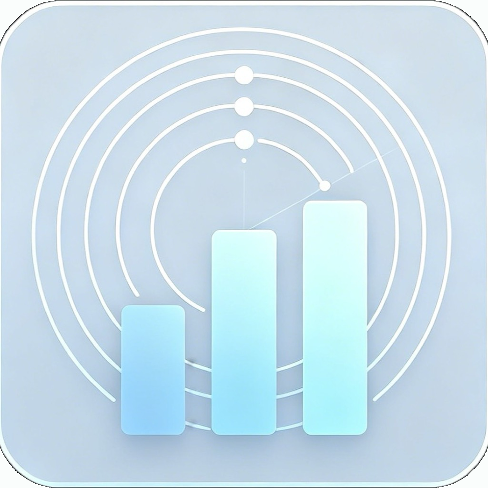

# ActivityGuard

<p align="center">
  
</p>

<p align="center">
  轻量 macOS 菜单栏系统监控工具 · 实时追踪资源占用 · 智能检测异常进程
</p>

<p align="center">
  A lightweight macOS menu bar monitor for system metrics and anomalous processes.
</p>

---

## Features

### Menu Bar

- 菜单栏实时显示 **CPU / 可用内存 / GPU / 网络**（可在设置中切换）
- **单击**图标：弹出小面板，查看 CPU 环形图、Top 进程与异常摘要
- **双击**图标：打开完整仪表盘
- **右键**：快捷打开面板、暂停/恢复监控、退出

### Dashboard

- **CPU / 内存 / GPU / 网络 / 电源** KPI 卡片，含 Sparkline 趋势图
- 进程总数、异常告警、最高消耗进程一览
- Top 进程列表，支持跳转完整进程视图

### Process List

- 按 CPU、CPU 时间、线程、内存、PID、名称排序
- 搜索过滤 + 按异常类型筛选
- 异常进程高亮标记（High CPU / Memory Leak / Zombie / High Energy）
- 一键终止进程（PID > 100，带确认）

### Alerts & Settings

- 异常进程系统通知，可配置通知间隔
- 过热（Thermal）状态提醒
- 开机自启动
- 暗色 / 亮色主题
- 中 / 英双语界面

---

## Requirements

| Item | Version |
|------|---------|
| macOS | 14.0+ |
| Architecture | Apple Silicon or Intel |
| Build | Xcode Command Line Tools |

---

## Installation

从 [Releases](https://github.com/Wuboing/ActivityGuard/releases) 下载 `ActivityGuard.dmg`，拖入「应用程序」即可。

> 首次打开若被 Gatekeeper 拦截：**右键 → 打开**。

---

## Build from Source

```bash
git clone git@github.com:Wuboing/ActivityGuard.git
cd ActivityGuard
bash scripts/build-dmg.sh
```

产物路径：

```
dist/ActivityGuard.app
dist/ActivityGuard.dmg
```

> 构建脚本默认使用项目内 `.toolchain/` 下的 Swift 编译器（已在 `.gitignore` 中，需自行准备或修改 `scripts/build-dmg.sh` 中的 `TOOLCHAIN_SWIFTC` 路径）。

### Replace App Icon

将源图放到 `Resources/AppIcon.png`，然后执行：

```bash
bash scripts/generate-app-icon.sh
```

脚本会自动裁剪圆角黑边并生成 `AppIcon.icns`。

---

## Usage

| 操作 | 效果 |
|------|------|
| 单击菜单栏图标 | 打开小面板（Metrics Popover） |
| 双击菜单栏图标 | 打开完整 Dashboard |
| 工具栏 ⚙️ | 设置：主题、语言、通知、菜单栏显示项 |
| 工具栏 ⏸ / ▶ | 暂停 / 恢复监控 |
| Dashboard → 查看全部 | 进入进程列表 |

---

## Project Structure

```
ActivityGuard/
├── Sources/
│   ├── ActivityGuardCore/       # 系统监控核心
│   │   ├── CPUMonitor.swift
│   │   ├── ProcessMonitor.swift
│   │   ├── AnomalyDetector.swift
│   │   ├── SystemMemoryMonitor.swift
│   │   ├── SystemGPUMonitor.swift
│   │   ├── SystemNetworkMonitor.swift
│   │   └── SystemPowerMonitor.swift
│   └── ActivityGuardApp/        # SwiftUI 应用层
│       ├── StatusBar/           # 菜单栏与主窗口
│       ├── Views/               # Dashboard、进程列表、设置
│       ├── ViewModel/           # AppViewModel 状态与轮询
│       ├── Services/            # 通知、开机启动
│       └── Localization/        # 中英双语
├── Resources/                   # AppIcon.png / AppIcon.icns
└── scripts/
    ├── build-dmg.sh             # 打包 .app + .dmg
    ├── generate-app-icon.sh     # 图标生成
    └── fix-icon-corners.py      # 去除图标四角黑边
```

---

## Tech Stack

- **Swift 6** + **SwiftUI** (macOS 14+)
- Darwin APIs: `proc_*`, `host_processor_info`, IOKit
- `@MainActor` + Timer 轮询（默认 10s）
- 无第三方依赖

---

## License

MIT
